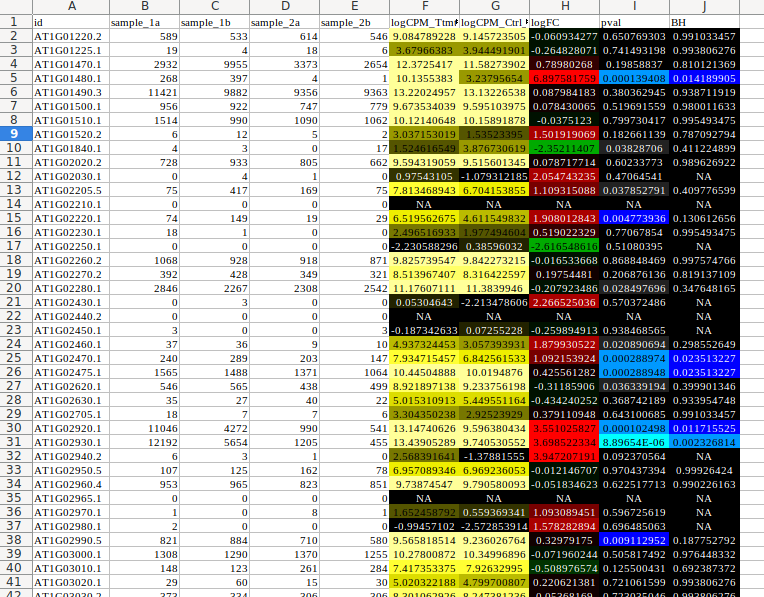
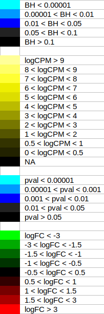

# AnaDiff : A tool for differential analysis of microarrays and RNAseq

This set of scripts allows differential analysis of microarrays and RNAseq.

- microarrays:
  - suitable for Agilent chips scanned by an Innopsys scanner,
  - uses Limma and httr packages.

- RNAseq:
  - starting from `.sf` files output from Salmon or `.counts` files output from samtools,
  - uses edgeR and DEseq2 packages.

## Create Rscript with the makefile script

### For RNAseq

Go to the RNAseq folder.

```{}
cd ./scripts/rnaseq
```

Run the `make` command.

```{}
make
```

A new Rscript is created, named : make_anaDiff_RNAseq_\<date\>.R

### For Agilent chips

Go to the agilent folder.

```{}
cd ./scripts/agilent
```

Run the `make` command.

```{}
make
```

A new Rscript is created, named : make_anaDiff_agilent_\<date\>.R

## Using script on data

First you have to create a summary file that describes your comparisons and their samples.

### RNAseq summary

Create a tabular file with one line for each sample of each comparison :

- Comparison : the name of the comparison. Must be unique for all lines of each comparison.
- File : the path of the file containing reads counts
- Name : the name of the sample source (the same for each biological replicate)
- Group : indicates if this sample is a control (denominator) or a treatment (numerator) for the ratio calculation

In the example below, we have two comparisons (CompA_S1-S2 and CompB_S1-S3).
The comparison CompA_S1-S2 contains 4 samples, two control samples (sample_2a and sample_2b) whose source sample name is S2 and two treated samples (sample_1a and sample_1b) whose source sample name is S1.

```{}
Comparison   File                    Name   Group
CompA_S1-S2  ../quant/sample_1a.sf   S1     Ttmt
CompA_S1-S2  ../quant/sample_1b.sf   S1     Ttmt
CompA_S1-S2  ../quant/sample_2a.sf   S2     Control
CompA_S1-S2  ../quant/sample_2b.sf   S2     Control
CompB_S1-S3  ../quant/sample_1a.sf   S1     Ttmt
CompB_S1-S3  ../quant/sample_1b.sf   S1     Ttmt
CompB_S1-S3  ../quant/sample_3a.sf   S3     Control
CompB_S1-S3  ../quant/sample_3b.sf   S3     Control
```

### RNAseq analysis

The script must be asked on RStudio. First, source the script and then run the anaDiff_RNAseq function. An RStudio interface will will query the user for the summary file described before, and then start the analysis for each comparison. One folder by comparison is created.

```{}
source('./rscripts/make_anaDiff_RNAseq_\<date\>.R')
anaDiff_RNAseq()
```

### RNAseq results

The resulting files are :
- a `.txt` file
- an `.html` file.

Open the txt and the html files on excel and then paste the values of the txt into the html file. Save as an xlsx format. The result is a formatted excel file.



Columns :

- A : id : the gene id from the counts file
- B-E : samples : the raw data for each counts file (adapted to the number of the sample in the comparison)
- F : the logCPM for the treatment sample source
- G : the logCPM for the control sample source
- H : the log fold change
- I : the pvalue
- J : the BH for DESeq analysis, the FDR for edgeR analysis

### Color scales


